# An Analysis of Constraint-Based Multi-Agent Pathfinding Algorithms - Data and Results
This repository holds all of the data and plots presented in the "An Analysis of Constraint-Based Multi_Agent Pathfinding Algorithms" paper. Raw and compiled data can be found in the Data repository. Grouped and Individual map plots are shown in the Figures directory. All figures are also present within this README. 

If you would like to run the data scraper and plot generator, please use the ExportData jupyter notebook to compile the raw data into csvs. Then, run the Plot jupyter notebook to generate all grouped and individual plots. 

If you have any questions, please contact me at [hannah9@illinois.edu](hannah9@illinois.edu). 

## Graph Statistics and Map Groupings

## Grouped Map Plots
| Group | Average Runtime | Success Rate | Flowtime Ratios | 
|--|--|--|--|
|  Empty |  |  |  | 
|  Random |  |  |  | 
|  Rooms |  |  |  | 
|  Maze |  |  |  | 
|  Cities |  |  |  | 
|  Games-Small |  |  |  | 
|  Games-Large |  |  |  |

## Individual Map Plots
| Map | Average Runtime | Success Rate | Flowtime Ratios | 
|--|--|--|--|
|  empty-8-8 |  |  |  | 
|  empty-16-16 |  |  |  | 
|  empty-32-32 |  |  |  | 
|  empty-48-48 |  |  | 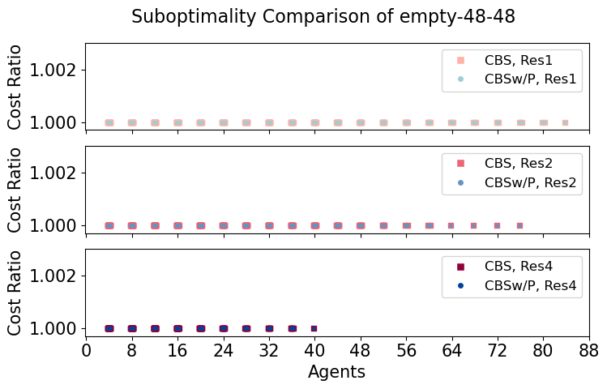 | 
|  random-32-32-10 |  | 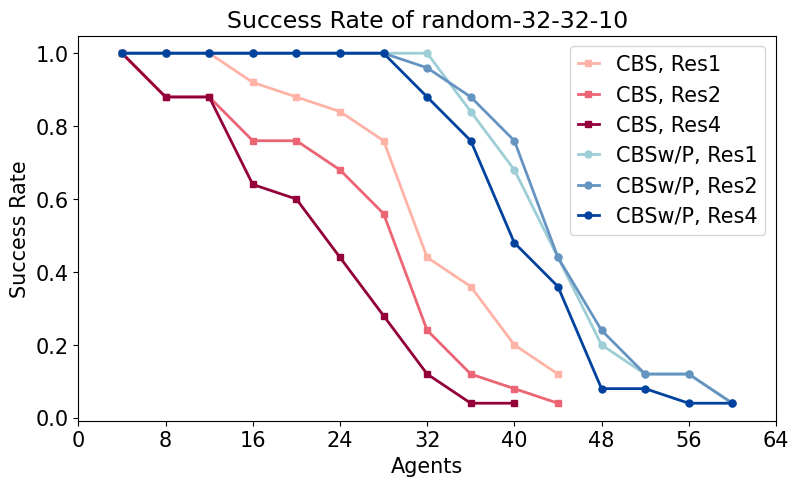 |  | 
|  random-32-32-20 |  |  |  | 
|  random-64-64-10 |  | 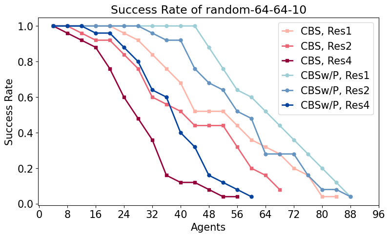 | 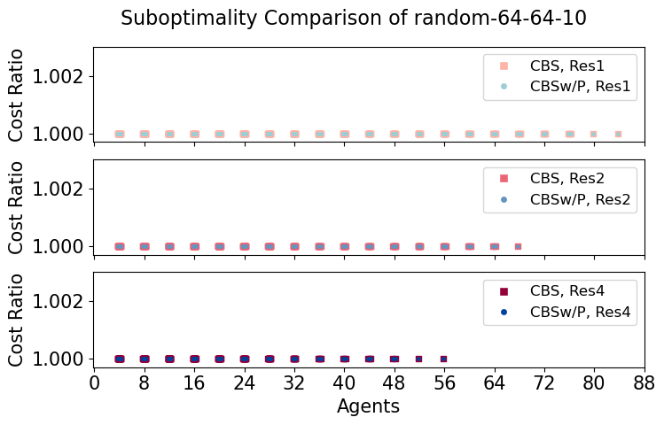 | 
|  random-64-64-20 |  |  |  | 
|  room-32-32-4 |  | 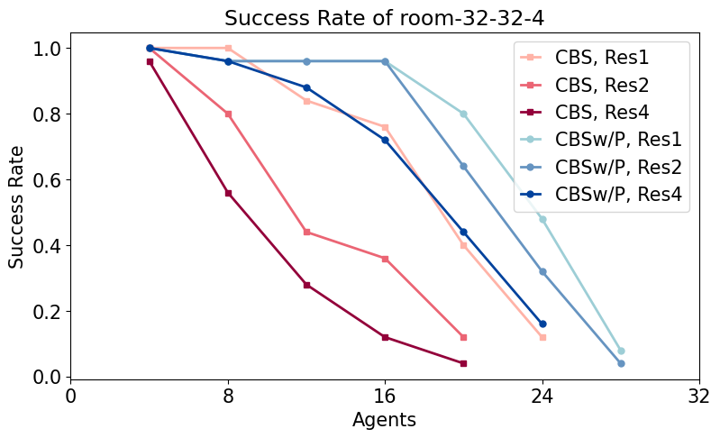 | 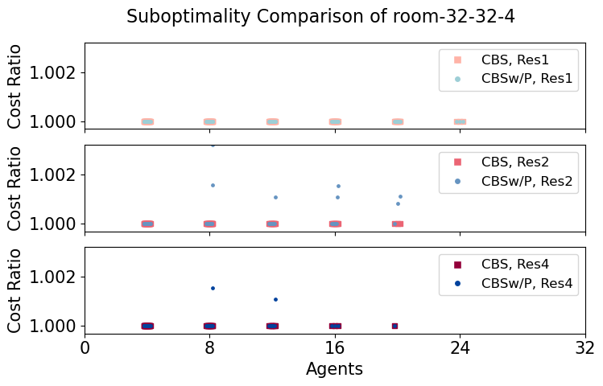 | 
|  room-64-64-8 |  |  | 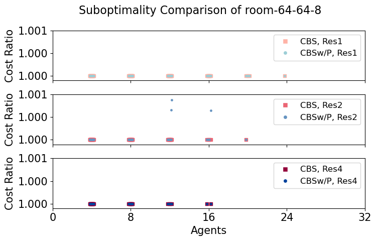 | 
|  room-64-64-16 |  | 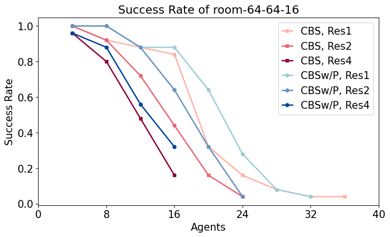 |  | 
|  maze-32-32-2 |  |  |  | 
|  maze-32-32-4 |  | 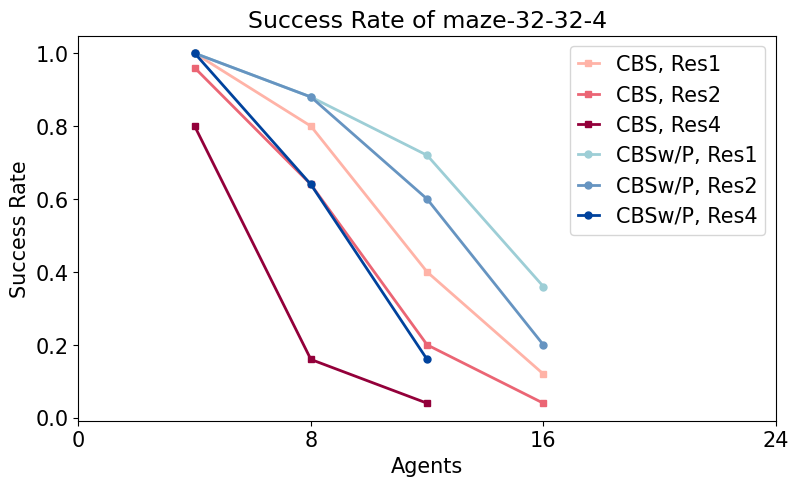 |  | 
|  maze-128-128-10 |  |  | 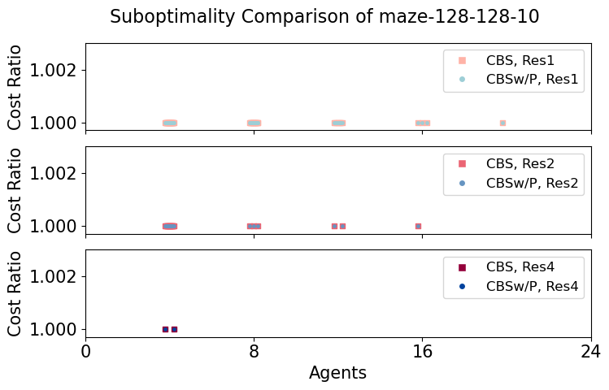 | 
|  maze-128-128-2 |  |  |  | 
|  Berlin_1_256 |  |  | 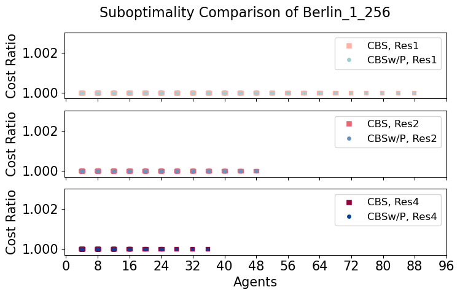 | 
|  Boston_0_256 |  |  |  | 
|  Paris_1_256 |  | 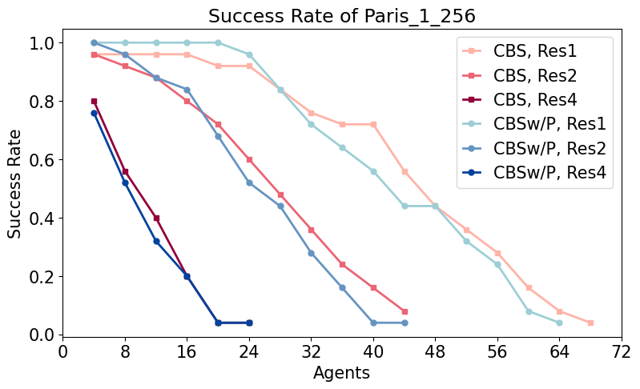 |  | 
|  ht_chantry |  |  |  | 
|  ht_mansion_n |  |  |  | 
|  lak303d |  | 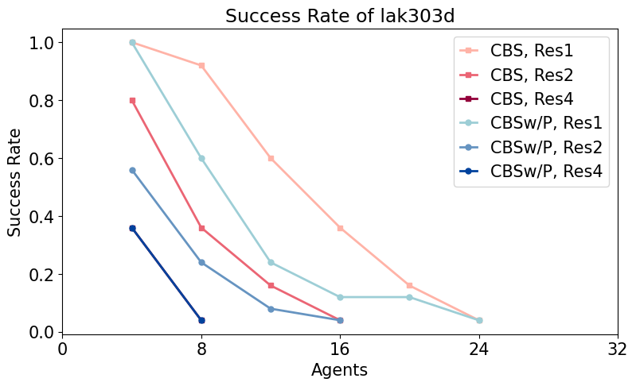 |  | 
|  lt_gallowstemplar_n |  |  |  | 
|  den312d |  | 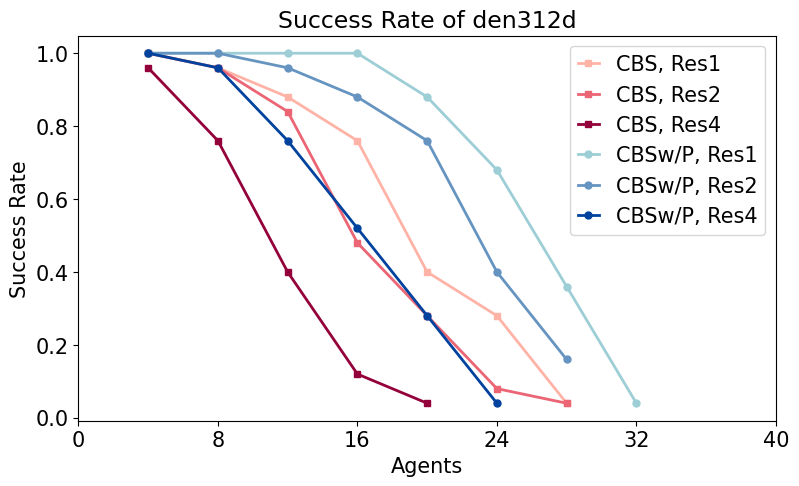 |  | 
|  ost003d |  | 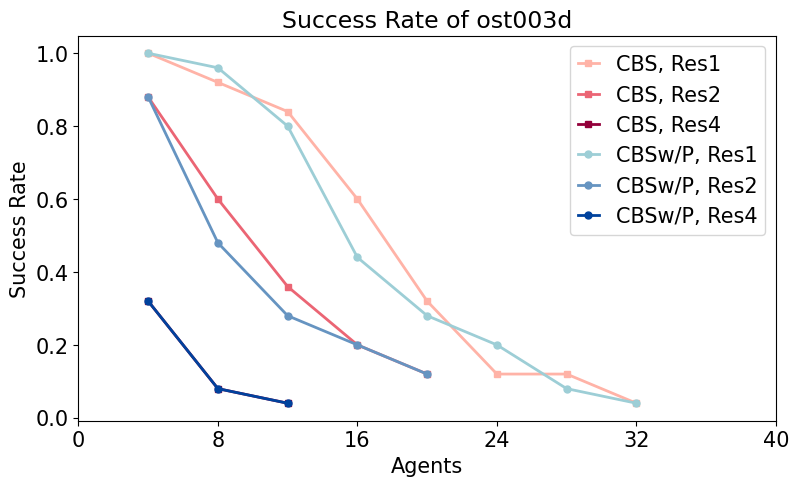 |  | 
|  brc202d |  |  |  | 
|  den520d |  |  |  | 
|  w_woundedcoast |  | 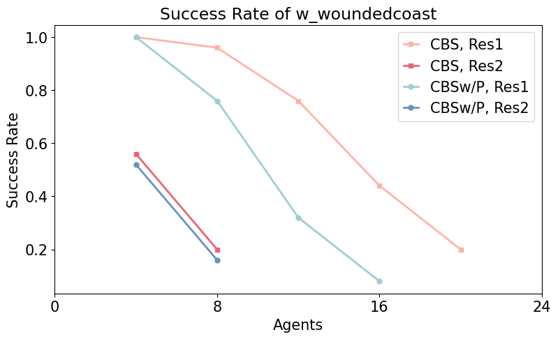 |  |

