# An Analysis of Constraint-Based Multi-Agent Pathfinding Algorithms - Data and Results
This repository holds all of the data and plots presented in the "An Analysis of Constraint-Based Multi_Agent Pathfinding Algorithms" paper. Raw and compiled data can be found in the Data repository. Grouped and Individual map plots are shown in the Figures directory. All figures are also present within this README.

If you are looking to reproduce our results, please see our [MANA-Core](https://github.com/hannahjmlee/MANA-Core/tree/constraint_analysis) repository. For our representation topological analysis code, please see our [TopologyAnalysis](https://github.com/hannahjmlee/TopologyAnalysis) repository.

If you would like to run the data scraper and plot generator, please run the Plot jupyter notebook to generate all grouped and individual plots.

If you have any questions, please contact me at [hannah9@illinois.edu](hannah9@illinois.edu).

 
 

## Grouped Map Plots
| Group | Average Runtime | Success Rate | Flowtime Ratios |
|--|--|--|--|
|  Empty |  |  | 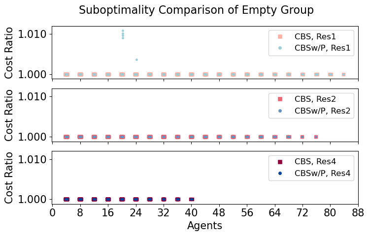 |
|  Random |  | 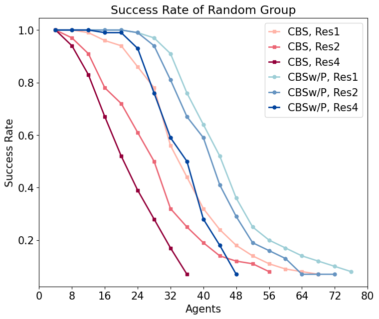 | 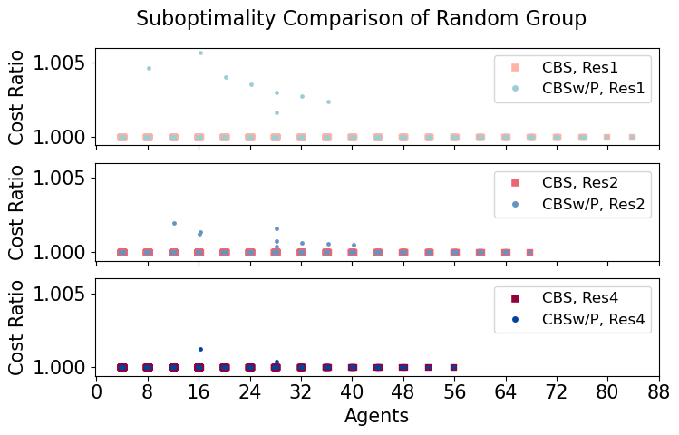 |
|  Narrow |  |  |  |
|  Cities |  |  | 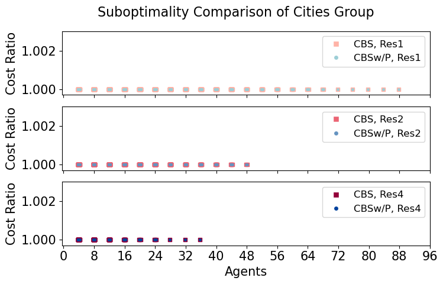 |
|  Games |  |  | 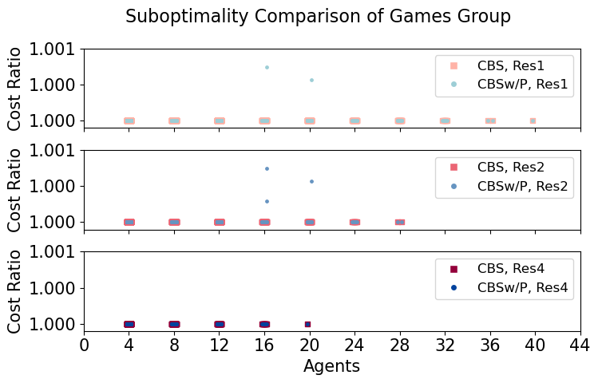 |

 
 

## Individual Map Plots
| Map | Average Runtime | Success Rate | Flowtime Ratios |
|--|--|--|--|
|  empty-8-8 |  |  | 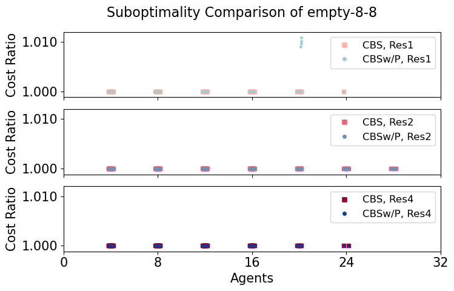 |
|  empty-16-16 |  |  |  |
|  empty-32-32 |  | 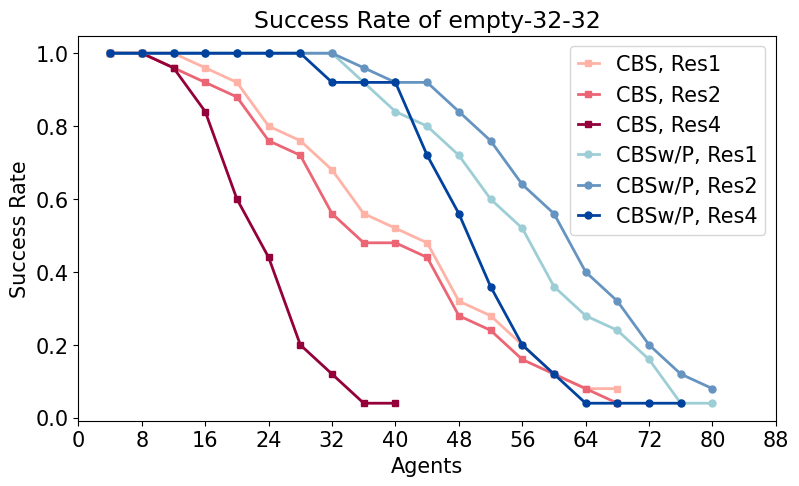 |  |
|  empty-48-48 |  |  |  |
|  random-32-32-10 |  |  |  |
|  random-32-32-20 |  |  |  |
|  random-64-64-10 |  |  |  |
|  random-64-64-20 |  |  | 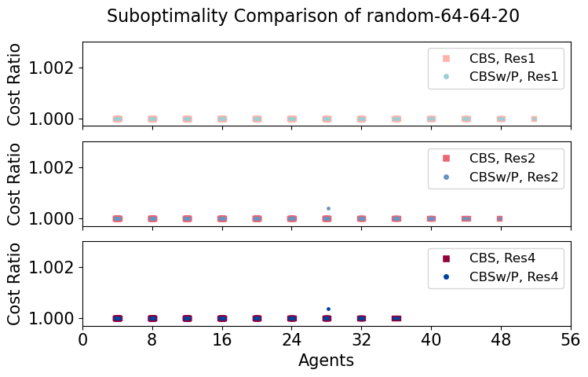 |
|  room-32-32-4 |  |  |  |
|  room-64-64-8 |  | 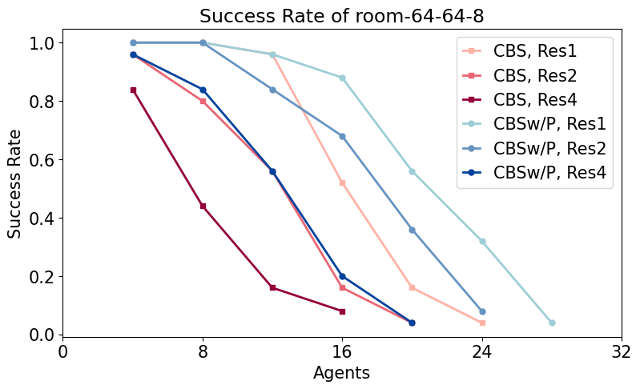 |  |
|  room-64-64-16 |  |  |  |
|  maze-32-32-2 |  |  |  |
|  maze-32-32-4 |  |  |  |
|  maze-128-128-10 |  |  |  |
|  maze-128-128-2 |  |  |  |
|  Berlin_1_256 |  |  |  |
|  Boston_0_256 |  | 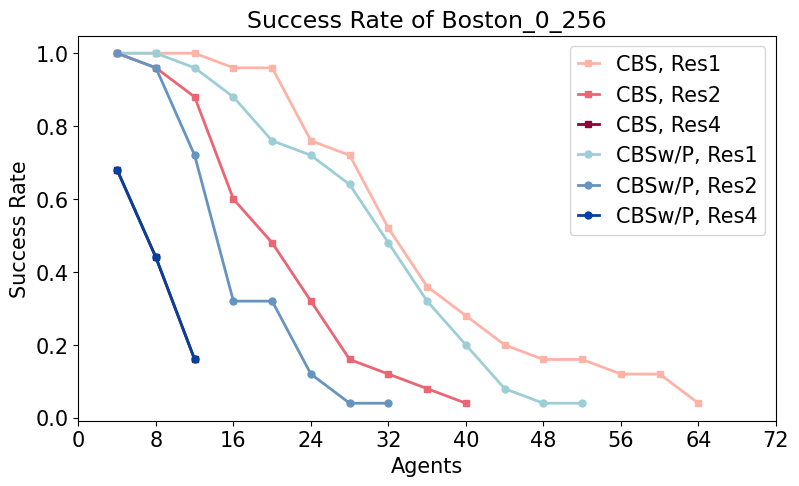 | 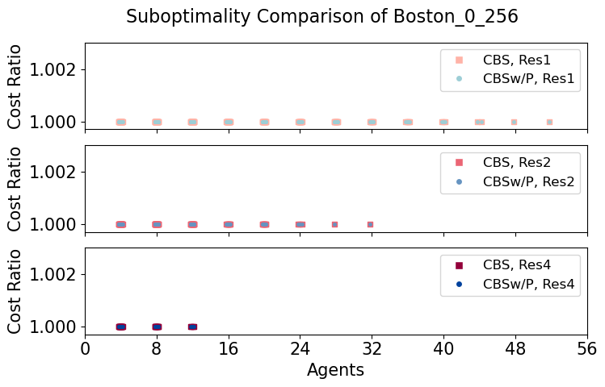 |
|  Paris_1_256 |  |  |  |
|  ht_chantry |  | 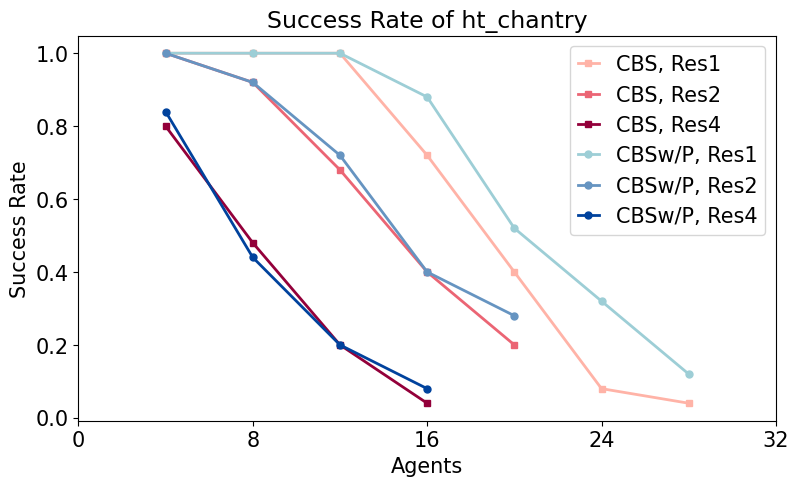 |  |
|  ht_mansion_n |  |  |  |
|  lak303d |  |  | 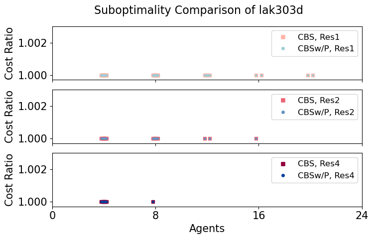 |
|  lt_gallowstemplar_n |  |  | 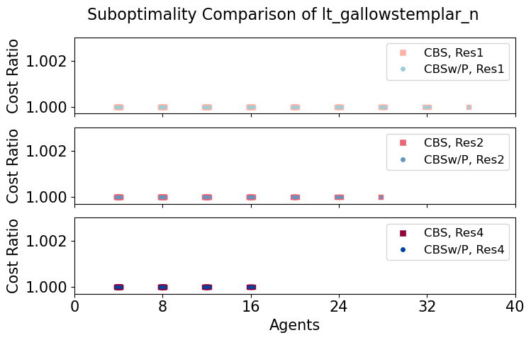 |
|  den312d |  |  |  |
|  ost003d |  |  | 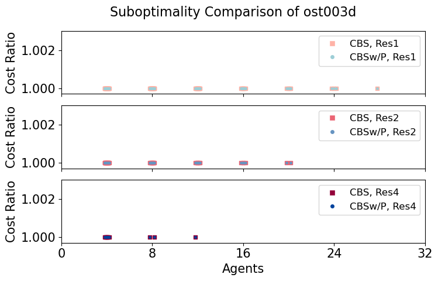 |
|  brc202d |  |  | 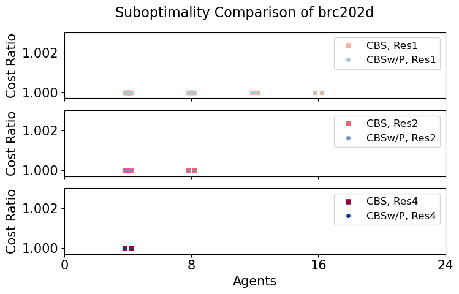 |
|  den520d |  | 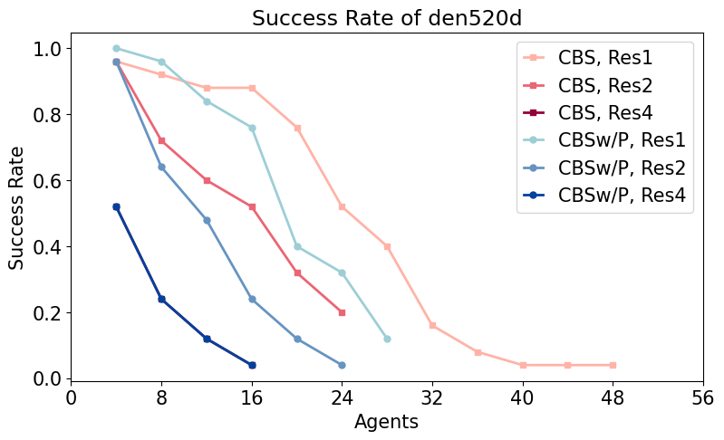 |  |
|  w_woundedcoast |  |  |  |

 
 

## Graph Statistics and Map Groupings
|  Type  	|         Map         	|    Size   	| Res 	| States 	| CBS Min 	| CBS Max 	| PBS Min 	| PBS Max 	|
|:------:	|:-------------------:	|:---------:	|:---:	|:------:	|:-------:	|:-------:	|:-------:	|:-------:	|
|  Empty 	| empty-8-8           	|   8 x 8   	|  1  	|     64 	|      12 	|      24 	|      12 	|      28 	|
|        	|                     	|           	|  2  	|    225 	|      12 	|      28 	|      24 	|      32 	|
|        	|                     	|           	|  4  	|    841 	|       4 	|      24 	|      20 	|      32 	|
|        	| empty-16-16         	|  16 x 16  	|  1  	|    256 	|      12 	|      36 	|      20 	|      40 	|
|        	|                     	|           	|  2  	|    961 	|       0 	|      40 	|      32 	|      56 	|
|        	|                     	|           	|  4  	|   3721 	|       0 	|      36 	|      24 	|      56 	|
|        	| empty-32-32         	|  32 x 32  	|  1  	|   1024 	|      12 	|      68 	|      32 	|      80 	|
|        	|                     	|           	|  2  	|   3969 	|       8 	|      68 	|      32 	|      80 	|
|        	|                     	|           	|  4  	|  15625 	|       8 	|      40 	|      28 	|      76 	|
|        	| empty-48-48         	|  48 x 48  	|  1  	|   2304 	|      16 	|      84 	|      48 	|      84 	|
|        	|                     	|           	|  2  	|   9025 	|      16 	|      76 	|      44 	|     100 	|
|        	|                     	|           	|  4  	|  35721 	|      12 	|      40 	|      16 	|      60 	|
| Random 	| random-32-32-10     	|  32 x 32  	|  1  	|    922 	|      12 	|      44 	|      32 	|      60 	|
|        	|                     	|           	|  2  	|   3185 	|       4 	|      44 	|      28 	|      60 	|
|        	|                     	|           	|  4  	|  11575 	|       4 	|      40 	|      28 	|      60 	|
|        	| random-32-32-20     	|  32 x 32  	|  1  	|    819 	|      12 	|      40 	|      24 	|      44 	|
|        	|                     	|           	|  2  	|   2468 	|       8 	|      40 	|      24 	|      44 	|
|        	|                     	|           	|  4  	|   8040 	|       4 	|      28 	|      20 	|      40 	|
|        	| random-64-64-10     	|  64 x 64  	|  1  	|   3687 	|      20 	|      84 	|      44 	|      88 	|
|        	|                     	|           	|  2  	|  12830 	|       8 	|      68 	|      28 	|      88 	|
|        	|                     	|           	|  4  	|  46764 	|       4 	|      56 	|      12 	|      60 	|
|        	| random-64-64-20     	|  64 x 64  	|  1  	|   3270 	|       8 	|      52 	|      20 	|      76 	|
|        	|                     	|           	|  2  	|  10031 	|       8 	|      48 	|      20 	|      48 	|
|        	|                     	|           	|  4  	|  33225 	|       8 	|      36 	|      20 	|      48 	|
| Narrow 	| room-32-32-4        	|  32 x 32  	|  1  	|    682 	|       8 	|      24 	|       4 	|      28 	|
|        	|                     	|           	|  2  	|   1902 	|       4 	|      20 	|       4 	|      28 	|
|        	|                     	|           	|  4  	|   5878 	|       0 	|      20 	|       4 	|      24 	|
|        	| room-64-64-8        	|  64 x 64  	|  1  	|   3232 	|       8 	|      24 	|       8 	|      28 	|
|        	|                     	|           	|  2  	|  11090 	|       0 	|      20 	|       8 	|      24 	|
|        	|                     	|           	|  4  	|  40630 	|       0 	|      16 	|       0 	|      20 	|
|        	| room-64-64-16       	|  64 x 64  	|  1  	|   3646 	|       4 	|      36 	|       8 	|      32 	|
|        	|                     	|           	|  2  	|  13585 	|       4 	|      24 	|       8 	|      24 	|
|        	|                     	|           	|  4  	|  52297 	|       0 	|      16 	|       0 	|      16 	|
|        	| maze-32-32-2        	|  32 x 32  	|  1  	|    666 	|       4 	|      16 	|       8 	|      20 	|
|        	|                     	|           	|  2  	|   1951 	|       0 	|      16 	|       4 	|      16 	|
|        	|                     	|           	|  4  	|   6381 	|       0 	|      12 	|       0 	|      12 	|
|        	| maze-32-32-4        	|  32 x 32  	|  1  	|    790 	|       4 	|      16 	|       4 	|      16 	|
|        	|                     	|           	|  2  	|   2695 	|       0 	|      16 	|       5 	|      16 	|
|        	|                     	|           	|  4  	|   9853 	|       0 	|      12 	|       4 	|      12 	|
|        	| maze-128-128-2      	| 128 x 128 	|  1  	|  10858 	|       0 	|      12 	|       0 	|      12 	|
|        	|                     	|           	|  2  	|  32383 	|       0 	|       4 	|       0 	|       4 	|
|        	|                     	|           	|  4  	| 107437 	|       0 	|       0 	|       0 	|       0 	|
|        	| maze-128-128-10     	| 128 x 128 	|  1  	|  14818 	|       0 	|      20 	|       0 	|      20 	|
|        	|                     	|           	|  2  	|  56143 	|       0 	|      16 	|       0 	|      16 	|
|        	|                     	|           	|  4  	| 218317 	|       0 	|       4 	|       0 	|       4 	|
| Cities 	| Berlin-1-256        	| 256 x 256 	|  1  	|  47536 	|       4 	|      88 	|      24 	|      92 	|
|        	|                     	|           	|  2  	| 182171 	|       4 	|      60 	|       8 	|      48 	|
|        	|                     	|           	|  4  	| 712615 	|       0 	|      36 	|       0 	|      36 	|
|        	| Boston-0-256        	| 256 x 256 	|  1  	|  47747 	|      12 	|      64 	|       8 	|      52 	|
|        	|                     	|           	|  2  	| 181232 	|       4 	|      40 	|       4 	|      32 	|
|        	|                     	|           	|  4  	| 705218 	|       0 	|      12 	|       0 	|      12 	|
|        	| Paris-1-256         	| 256 x 256 	|  1  	|  47216 	|       0 	|      68 	|      24 	|      64 	|
|        	|                     	|           	|  2  	| 179271 	|       0 	|      44 	|       4 	|      44 	|
|        	|                     	|           	|  4  	| 697685 	|       0 	|      24 	|       0 	|      24 	|
|  Games 	| ht-chantry          	| 141 x 162 	|  1  	|   7461 	|      12 	|      28 	|      12 	|      28 	|
|        	|                     	|           	|  2  	|  27912 	|       4 	|      20 	|       4 	|      20 	|
|        	|                     	|           	|  4  	| 107742 	|       0 	|      16 	|       0 	|      16 	|
|        	| ht-mansion-n        	| 270 x 133 	|  1  	|   8959 	|       4 	|      40 	|      12 	|      40 	|
|        	|                     	|           	|  2  	|  33376 	|       4 	|      32 	|       0 	|      24 	|
|        	|                     	|           	|  4  	| 128554 	|       0 	|      20 	|       0 	|      16 	|
|        	| lak303d             	| 194 x 194 	|  1  	|  14784 	|       4 	|      24 	|       4 	|      24 	|
|        	|                     	|           	|  2  	|  54938 	|       0 	|      16 	|       0 	|      16 	|
|        	|                     	|           	|  4  	| 211230 	|       0 	|       8 	|       0 	|       8 	|
|        	| lt-gallowstemplar-n 	| 180 x 251 	|  1  	|  10021 	|       8 	|      36 	|      12 	|      36 	|
|        	|                     	|           	|  2  	|  54938 	|       0 	|      16 	|       0 	|      16 	|
|        	|                     	|           	|  4  	| 211230 	|       0 	|       8 	|       0 	|       8 	|
|        	| den312d             	|  81 x 65  	|  1  	|   2445 	|       4 	|      28 	|      16 	|      32 	|
|        	|                     	|           	|  2  	|   8779 	|       4 	|      28 	|       8 	|      28 	|
|        	|                     	|           	|  4  	|  33105 	|       0 	|      20 	|       4 	|      24 	|
|        	| ost003d             	| 194 x 194 	|  1  	|  13214 	|       4 	|      32 	|       4 	|      32 	|
|        	|                     	|           	|  2  	|  49986 	|       0 	|      20 	|       0 	|      20 	|
|        	|                     	|           	|  4  	| 194168 	|       0 	|      12 	|       0 	|      12 	|
|        	| brc202d             	| 481 x 530 	|  1  	|  43151 	|       0 	|      16 	|       0 	|      16 	|
|        	|                     	|           	|  2  	| 162968 	|       0 	|       8 	|       0 	|       8 	|
|        	|                     	|           	|  4  	| 632432 	|       0 	|       4 	|       0 	|       4 	|
|        	| den520d             	| 257 x 256 	|  1  	|  28178 	|       0 	|      48 	|       4 	|      28 	|
|        	|                     	|           	|  2  	| 108918 	|       0 	|      24 	|       0 	|      24 	|
|        	|                     	|           	|  4  	| 427970 	|       0 	|      16 	|       0 	|      16 	|
|        	| w-woundedcoast      	| 578 x 642 	|  1  	|  34002 	|       4 	|      20 	|       4 	|      16 	|
|        	|                     	|           	|  2  	| 127838 	|       0 	|       8 	|       0 	|       8 	|
|        	|                     	|           	|  4  	| 495024 	|       0 	|       0 	|       0 	|       0 	|
