# An Analysis of Constraint-Based Multi-Agent Pathfinding Algorithms - Data and Results
This repository holds all of the data and plots presented in the "An Analysis of Constraint-Based Multi_Agent Pathfinding Algorithms" paper. Raw and compiled data can be found in the Data repository. Grouped and Individual map plots are shown in the Figures directory. All figures are also present within this README.

If you would like to run the data scraper and plot generator, please unzip the stat_files.zip and then use the ExportData jupyter notebook to compile the raw data into csvs. Then, run the Plot jupyter notebook to generate all grouped and individual plots.

If you have any questions, please contact me at [hannah9@illinois.edu](hannah9@illinois.edu).

 
 

## Grouped Map Plots
| Group | Average Runtime | Success Rate | Flowtime Ratios |
|--|--|--|--|
|  Empty |  |  |  |
|  Random |  |  |  |
|  Narrow |  |  |  |
|  Cities |  |  |  |
|  Games |  |  |  |

 
 

## Individual Map Plots
| Map | Average Runtime | Success Rate | Flowtime Ratios |
|--|--|--|--|
|  empty-8-8 |  |  |  |
|  empty-16-16 |  | 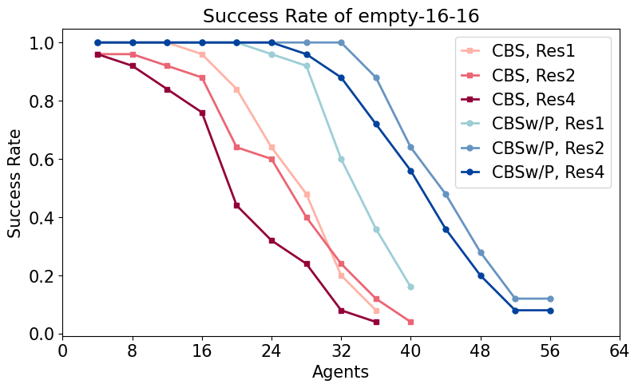 | 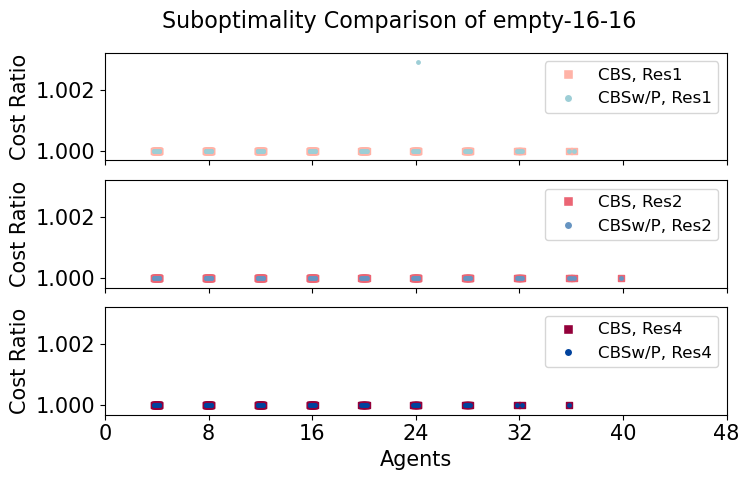 |
|  empty-32-32 |  |  | 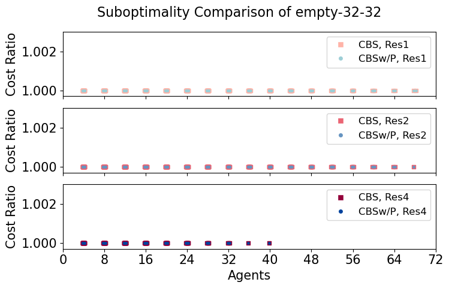 |
|  empty-48-48 |  | 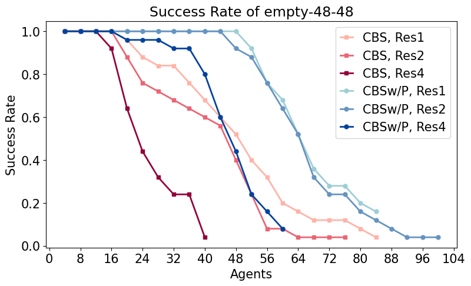 |  |
|  random-32-32-10 |  |  | 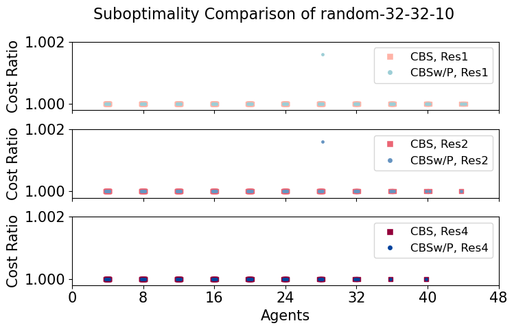 |
|  random-32-32-20 |  | 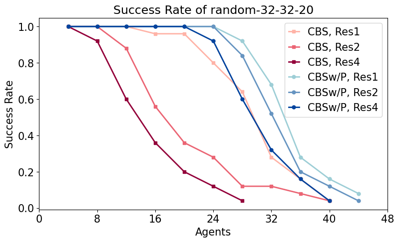 | 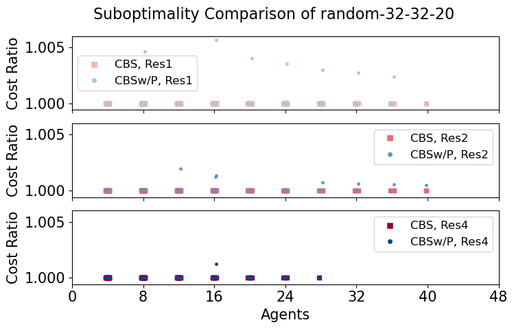 |
|  random-64-64-10 |  |  |  |
|  random-64-64-20 |  |  |  |
|  room-32-32-4 |  |  |  |
|  room-64-64-8 |  |  |  |
|  room-64-64-16 |  |  |  |
|  maze-32-32-2 |  |  | 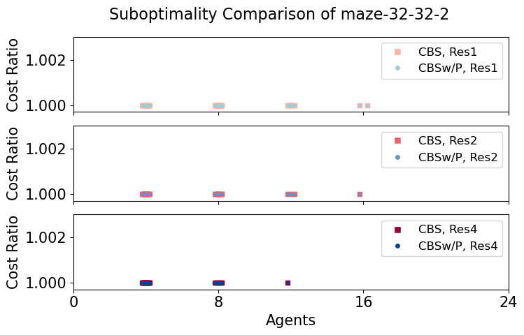 |
|  maze-32-32-4 |  |  | 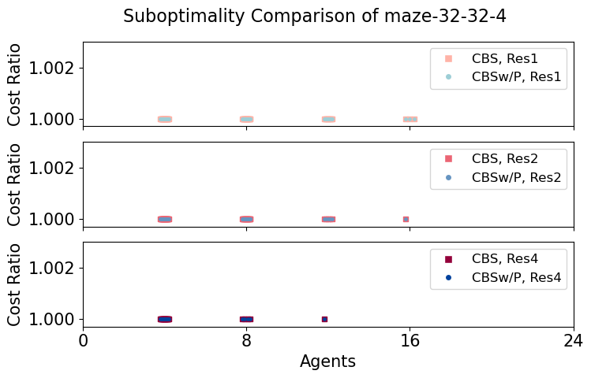 |
|  maze-128-128-10 |  |  |  |
|  maze-128-128-2 |  |  | 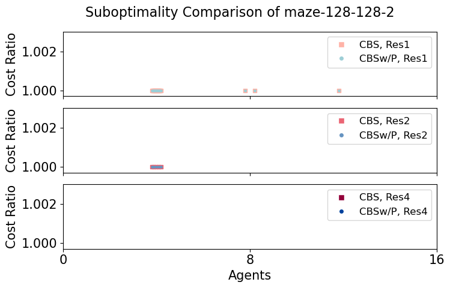 |
|  Berlin_1_256 |  | 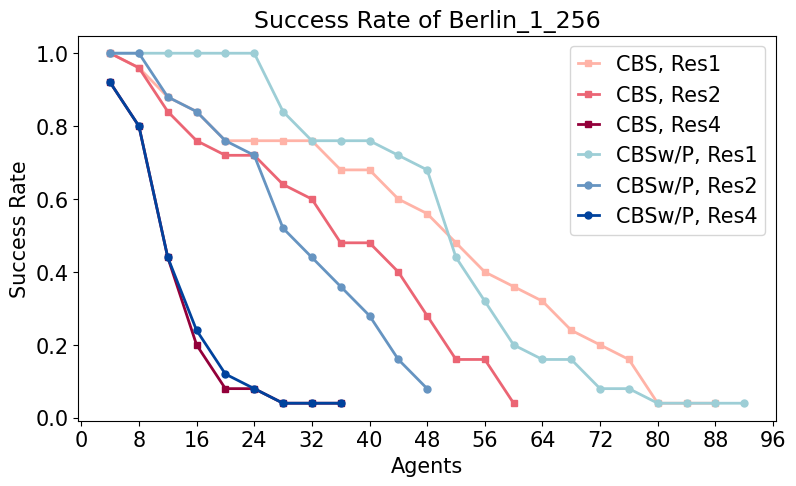 |  |
|  Boston_0_256 |  |  |  |
|  Paris_1_256 |  |  | 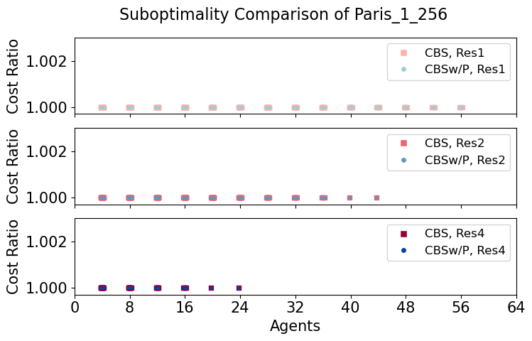 |
|  ht_chantry |  |  | 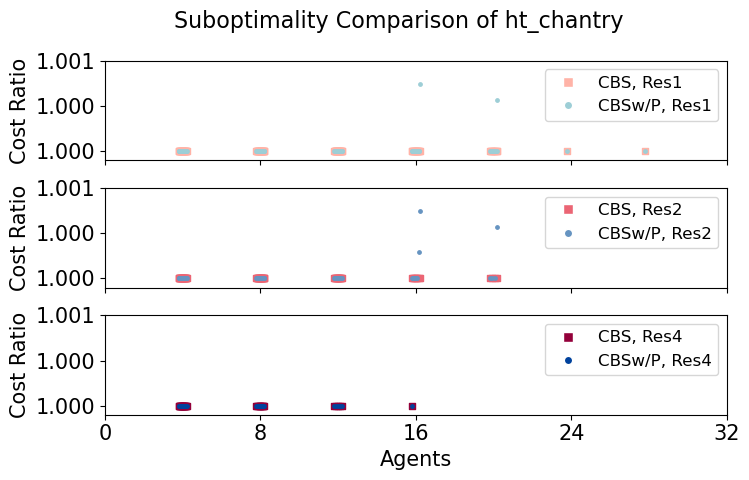 |
|  ht_mansion_n |  | 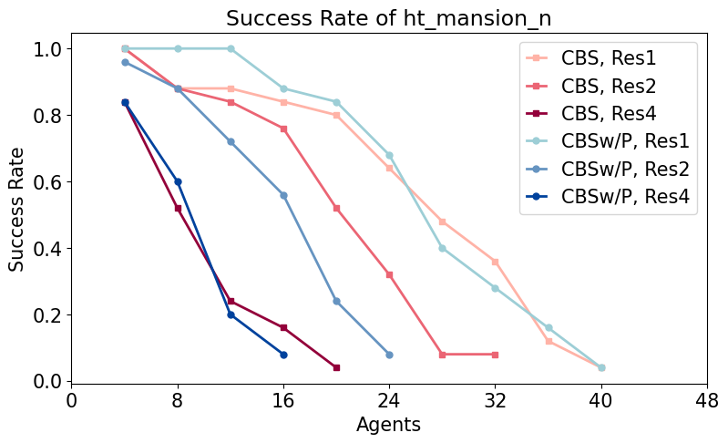 |  |
|  lak303d |  |  |  |
|  lt_gallowstemplar_n |  | 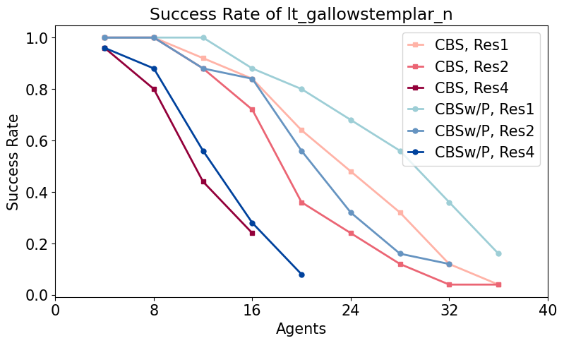 |  |
|  den312d |  |  | 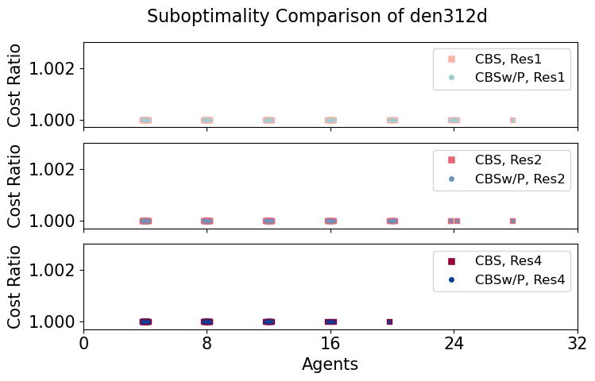 |
|  ost003d |  |  |  |
|  brc202d |  | 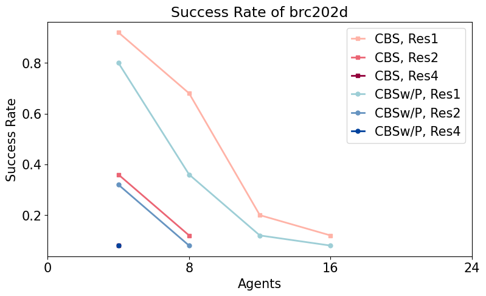 |  |
|  den520d |  |  |  |
|  w_woundedcoast |  |  | 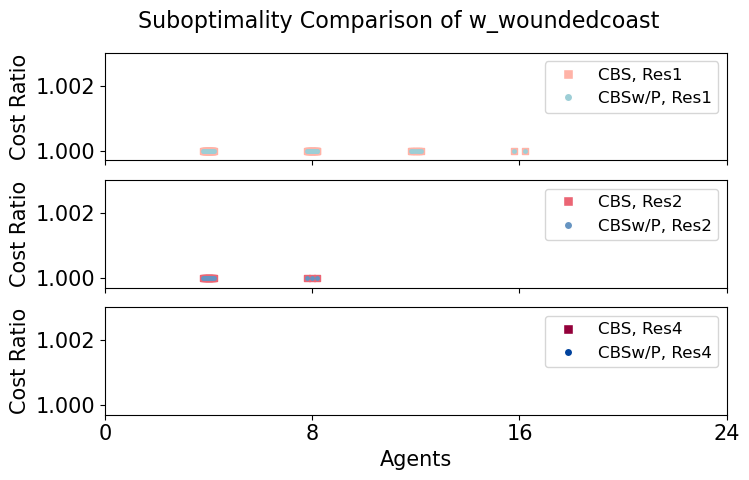 |

 
 

## Graph Statistics and Map Groupings
| Type          | Map                 | Size      | Res | States | CBS Min | CBS Max | PBS Min | PBS Max |
|---------------|---------------------|-----------|-----|--------|---------|---------|---------|---------|
| Empty         | empty-8-8           | 8 x 8     | 1   | 64     | 14      | 24      | 14      | 30      |
|               |                     |           | 2   | 225    | 16      | 30      | 22      | 30      |
|               |                     |           | 4   | 841    | 8       | 30      | 20      | 30      |
|               | empty-16-16         | 16 x 16   | 1   | 256    | 14      | 38      | 20      | 44      |
|               |                     |           | 2   | 961    | 14      | 40      | 24      | 56      |
|               |                     |           | 4   | 3721   | 2       | 38      | 20      | 50      |
|               | empty-32-32         | 32 x 32   | 1   | 1024   | 10      | 60      | 32      | 60      |
|               |                     |           | 2   | 3969   | 10      | 60      | 32      | 60      |
|               |                     |           | 4   | 15625  | 10      | 42      | 26      | 56      |
|               | empty-48-48         | 48 x 48   | 1   | 2304   | 22      | 60      | 32      | 60      |
|               |                     |           | 2   | 9025   | 16      | 54      | 22      | 60      |
|               |                     |           | 4   | 35721  | 8       | 48      | 10      | 60      |
| Random        | random-32-32-10     | 32 x 32   | 1   | 922    | 8       | 48      | 28      | 58      |
|               |                     |           | 2   | 3185   | 6       | 46      | 26      | 58      |
|               |                     |           | 4   | 11575  | 6       | 44      | 16      | 46      |
|               | random-32-32-20     | 32 x 32   | 1   | 819    | 14      | 40      | 22      | 44      |
|               |                     |           | 2   | 2468   | 8       | 40      | 22      | 40      |
|               |                     |           | 4   | 8040   | 8       | 36      | 18      | 40      |
|               | random-64-64-10     | 64 x 64   | 1   | 3687   | 4       | 60      | 36      | 60      |
|               |                     |           | 2   | 12830  | 4       | 60      | 12      | 60      |
|               |                     |           | 4   | 46764  | 4       | 44      | 4       | 52      |
|               | random-64-64-20     | 64 x 64   | 1   | 3270   | 16      | 54      | 26      | 58      |
|               |                     |           | 2   | 10031  | 8       | 46      | 22      | 48      |
|               |                     |           | 4   | 33225  | 8       | 36      | 14      | 46      |
| Narrow        | room-32-32-4        | 32 x 32   | 1   | 682    | 10      | 24      | 4       | 28      |
|               |                     |           | 2   | 1902   | 4       | 22      | 4       | 26      |
|               |                     |           | 4   | 5878   | 4       | 20      | 4       | 26      |
|               | room-64-64-8        | 64 x 64   | 1   | 3232   | 6       | 20      | 10      | 26      |
|               |                     |           | 2   | 11090  | 4       | 18      | 6       | 20      |
|               |                     |           | 4   | 40630  | 2       | 16      | 4       | 18      |
|               | room-64-64-16       | 64 x 64   | 1   | 3646   | 6       | 30      | 10      | 28      |
|               |                     |           | 2   | 13585  | 6       | 20      | 10      | 22      |
|               |                     |           | 4   | 52297  | 2       | 18      | 2       | 18      |
|               | maze-32-32-2        | 32 x 32   | 1   | 666    | 6       | 18      | 6       | 20      |
|               |                     |           | 2   | 1951   | 6       | 16      | 6       | 16      |
|               |                     |           | 4   | 6381   | 2       | 12      | 2       | 16      |
|               | maze-32-32-4        | 32 x 32   | 1   | 790    | 2       | 16      | 4       | 20      |
|               |                     |           | 2   | 2695   | 2       | 16      | 4       | 18      |
|               |                     |           | 4   | 9853   | 2       | 16      | 2       | 18      |
|               | maze-128-128-2      | 128 x 128 | 1   | 10858  | 2       | 12      | 2       | 10      |
|               |                     |           | 2   | 32383  | 2       | 4       | 2       | 4       |
|               |                     |           | 4   | 107437 | 2       | 4       | 2       | 4       |
|               | maze-128-128-10     | 128 x 128 | 1   | 14818  | 2       | 20      | 4       | 20      |
|               |                     |           | 2   | 56143  | 2       | 10      | 2       | 10      |
|               |                     |           | 4   | 218317 | 2       | 4       | 2       | 4       |
| Cities        | Berlin-1-256        | 256 x 256 | 1   | 47536  | 8       | 60      | 8       | 60      |
|               |                     |           | 2   | 182171 | 8       | 28      | 8       | 28      |
|               |                     |           | 4   | 712615 | 2       | 14      | 2       | 14      |
|               | Boston-0-256        | 256 x 256 | 1   | 47747  | 8       | 52      | 8       | 52      |
|               |                     |           | 2   | 181232 | 2       | 26      | 2       | 26      |
|               |                     |           | 4   | 705218 | 2       | 10      | 2       | 10      |
|               | Paris-1-256         | 256 x 256 | 1   | 47216  | 2       | 46      | 12      | 54      |
|               |                     |           | 2   | 179271 | 2       | 34      | 4       | 34      |
|               |                     |           | 4   | 697685 | 2       | 16      | 2       | 16      |
| Games         | ht-chantry          | 141 x 162 | 1   | 7461   | 6       | 26      | 10      | 30      |
|               |                     |           | 2   | 27912  | 4       | 22      | 4       | 22      |
|               |                     |           | 4   | 107742 | 2       | 16      | 2       | 16      |
|               | ht-mansion-n        | 270 x 133 | 1   | 8959   | 6       | 40      | 18      | 50      |
|               |                     |           | 2   | 33376  | 4       | 34      | 8       | 34      |
|               |                     |           | 4   | 128554 | 2       | 28      | 2       | 28      |
|               | lak303d             | 194 x 194 | 1   | 14784  | 2       | 22      | 2       | 18      |
|               |                     |           | 2   | 54938  | 2       | 16      | 2       | 16      |
|               |                     |           | 4   | 211230 | 2       | 8       | 2       | 8       |
|               | lt-gallowstemplar-n | 180 x 251 | 1   | 10021  | 4       | 32      | 6       | 38      |
|               |                     |           | 2   | 37637  | 4       | 28      | 4       | 28      |
|               |                     |           | 4   | 145549 | 4       | 20      | 4       | 20      |
|               | den312d             | 81 x 65   | 1   | 2445   | 6       | 28      | 20      | 36      |
|               |                     |           | 2   | 8779   | 6       | 28      | 12      | 30      |
|               |                     |           | 4   | 33105  | 2       | 18      | 2       | 24      |
|               | ost003d             | 194 x 194 | 1   | 13214  | 4       | 22      | 4       | 20      |
|               |                     |           | 2   | 49986  | 2       | 18      | 2       | 16      |
|               |                     |           | 4   | 194168 | 2       | 10      | 2       | 12      |
|               | brc202d             | 481 x 530 | 1   | 43151  | 2       | 12      | 2       | 12      |
|               |                     |           | 2   | 162968 | 2       | 10      | 2       | 8       |
|               |                     |           | 4   | 632432 | 2       | 4       | 2       | 4       |
|               | den520d             | 257 x 256 | 1   | 28178  | 8       | 42      | 8       | 40      |
|               |                     |           | 2   | 108918 | 2       | 26      | 2       | 26      |
|               |                     |           | 4   | 427970 | 2       | 14      | 2       | 14      |
|               | w-woundedcoast      | 578 x 642 | 1   | 34002  | 2       | 14      | 2       | 14      |
|               |                     |           | 2   | 127838 | 2       | 10      | 2       | 10      |
|               |                     |           | 4   | 495024 | 0       | 0       | 0       | 0       |
